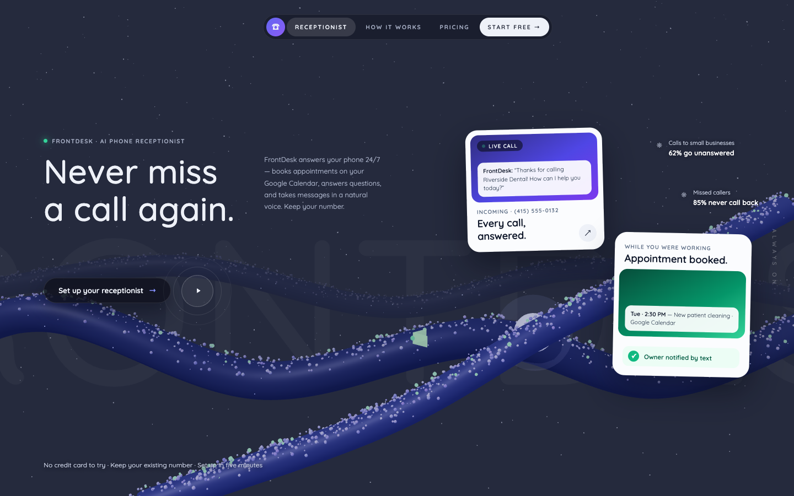

# threejs-hero — a Claude Code skill for immersive 3D landing pages

A [Claude Code](https://claude.com/claude-code) skill that teaches the agent to build
**Sylva-style immersive Three.js hero pages** as a single self-contained HTML file:
a foggy monochromatic 3D world, organic geometry sweeping the lower half, crisp DOM
overlay UI, mouse-orbit parallax, pointer particles, a Death-Stranding-style wireframe
scan intro, glass cards with scan-line reveals, and a small living creature — all under
1 MB of code, no build step, verified via a headless-Chrome screenshot loop.

| Sylva replica (bundled example) | Wireframe scan intro | Applied to a real brand |
|---|---|---|
|  |  |  |

## Install

```bash
git clone https://github.com/jiangyurong609/threejs-hero-skill.git
cp -r threejs-hero-skill/threejs-hero ~/.claude/skills/
```

Then in Claude Code, prompts like these will route through the skill:

- "Build me a 3D landing page for my brand, orbit using the mouse, add particles to pointer"
- "Recreate this in Three.js in a single HTML file. Self-verify until perfect."
- "Give the hero a wireframe intro like the field-scanning effect in Death Stranding"
- "Add a butterfly that lands on the branch and flies away on mouse-over"

## What the skill encodes

- **Architecture**: 3 fixed layers — ghost brand wordmark (z0), transparent WebGL
  canvas (z1), DOM overlay UI (z2). Text is always DOM, never 3D.
- **The one fog trick**: `scene.fog` color == page background color ⇒ infinite depth.
- **The transform trap**: parallax, entrance animations, centering, and card tilt must
  live on separate elements / separate CSS properties (`translate`, `rotate`) or they
  silently clobber each other.
- **Time rules**: intro driven by elapsed time (never accumulated per-frame deltas),
  plus a `?still` URL mode so headless screenshots are deterministic.
- **Effect recipes**: tube-geometry limbs + instanced fuzz (14k cones), pointer-biased
  particle drift, low-poly wireframe scan clones, scan-line card reveals, creature
  state machine (fly → rest → flee), traveling pulses.
- **Self-verify loop**: headless Chrome + SwiftShader screenshot commands, what to
  check in each shot, and how to catch silent JS/shader failures.

## Bundled examples

- [`threejs-hero/examples/sylva-replica.html`](threejs-hero/examples/sylva-replica.html)
  — replica study of the original nature scene (open it in a browser, move the mouse,
  hover the butterfly).
- [`threejs-hero/examples/frontdesk-hero.html`](threejs-hero/examples/frontdesk-hero.html)
  — the same recipe re-themed for a real SaaS brand
  ([FrontDesk](https://frontdeskhq.co), an AI phone receptionist): the mossy branches
  become glowing call-wires, the butterfly becomes a message spark, call pulses flow
  into a receptionist orb.

Verify either file locally:

```bash
CHROME="/Applications/Google Chrome.app/Contents/MacOS/Google Chrome"
"$CHROME" --headless=new --enable-unsafe-swiftshader --window-size=1440,900 \
  --screenshot=out.png --virtual-time-budget=8000 \
  "file://$PWD/threejs-hero/examples/sylva-replica.html?still"
```

## Credits

- Inspired by [Meng To](https://twitter.com/MengTo)'s "Sylva — Into the living world"
  demo and his write-up on prompting Opus 5 to build Three.js landing pages
  (inspiration he cited: <https://instagram.com/p/DYVXOx6kdmq>). The bundled Sylva
  example is an original-code replica study of that design, included for education.
- Built and verified with Claude Code.

## License

MIT — see [LICENSE](LICENSE). The Sylva visual design belongs to its original author;
the replica is included as an educational study.
