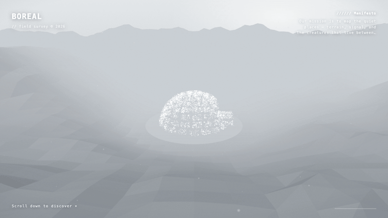
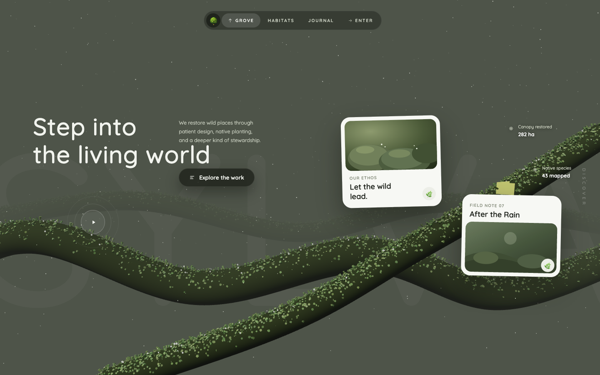
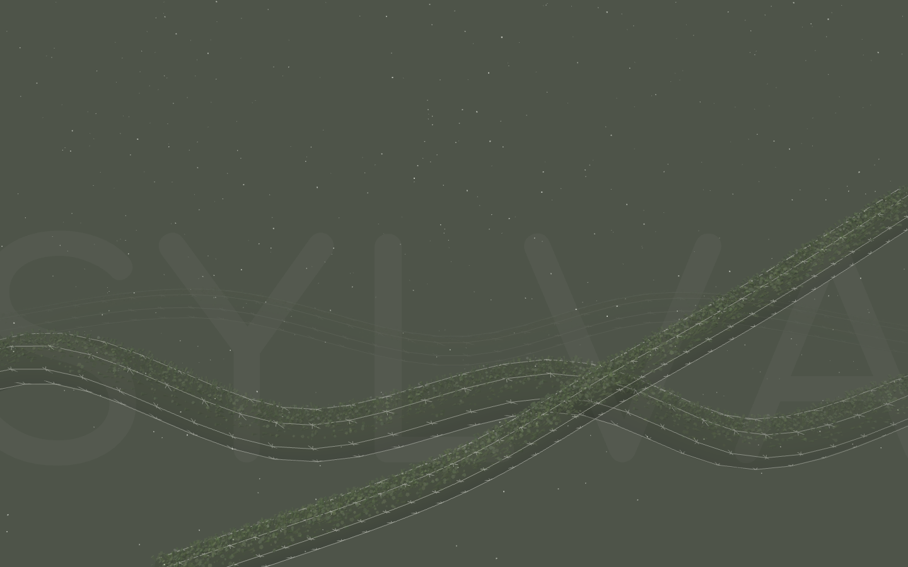
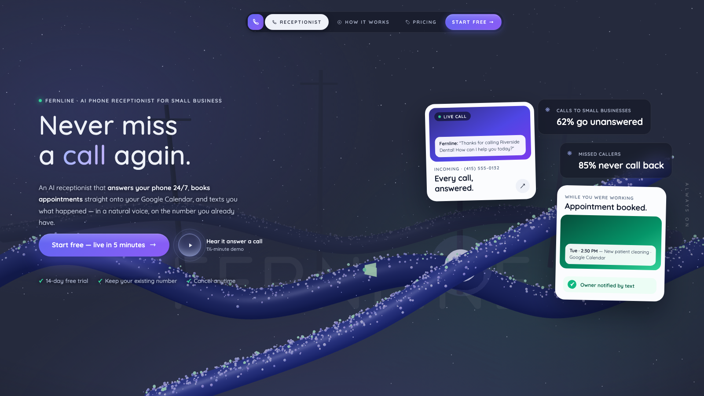
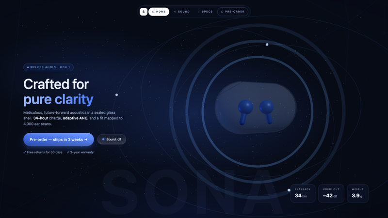
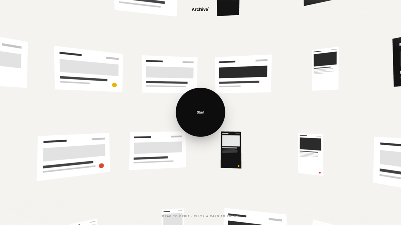
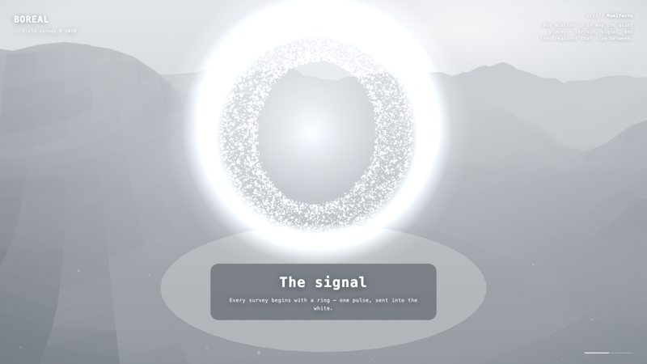
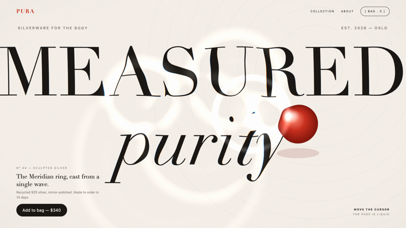
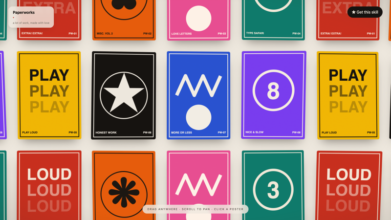

# motion-pages — a Claude Code skill for award-site motion

Immersive Three.js worlds, liquid-glass shader typography, springy poster walls —
single-file pages, screenshot-verified.

**🌐 Showcase: <https://motion-pages.pages.dev>** (mirror:
<https://jiangyurong609.github.io/motion-pages/>)

On the showcase you can:

- **▶ Run every demo inline** — each gallery card plays its world right in the grid;
- **🎛 Use the Playground** — type a brand name + tagline, pick a palette hue and an
  archetype (glass product / particle morph / liquid glass), and watch a live world
  rebuild as you type — then copy a prompt that carries your exact brand, palette,
  and archetype into Claude Code;
- **⧉ Copy full build-spec prompts** — not one-liners: each example's prompt pins the
  layer stack, palette values, geometry parameters, shader math, timings, responsive
  rules, and the self-verify recipe (they live in [`docs/prompts/`](docs/prompts/));
- **🔎 Clone the feel of any site** — a prompt template that has the agent browse a
  reference URL, storyboard it at several scroll depths, map its motion patterns to
  the skill's recipes, and rebuild that motion language as original code for *your*
  brand;
- **🤖 Hand it to any agent** — [`llms.txt`](docs/llms.txt) links the full skill and
  every live example for AI agents outside Claude Code.



A [Claude Code](https://claude.com/claude-code) skill that teaches the agent to build
**award-site-style immersive Three.js pages** as a single HTML file (+ a vendored
three.js): the Sylva-style foggy hero (organic geometry, crisp DOM overlay UI,
mouse-orbit parallax, pointer particles, Death-Stranding wireframe scan intro, glass
cards, a living creature) **plus four more archetypes distilled from award-winning
sites** — a glass product stage with sonar rings (AETHER:1-style), a drag-orbit dome
gallery with click-to-focus camera flights (OpenPurpose-style), scroll-driven camera
journeys with particle shape morphs (Igloo-Inc-style), and recipes for cursor mask
reveals (Lando Norris), paper poster walls (MISC), and webcam gesture control — all
with no build step, **responsive down to phones, touch- and reduced-motion-aware**,
verified via a multi-viewport headless-Chrome screenshot loop **plus a design-review
(aesthetic + conversion) pass**, so the result is ready to mount in a production
webapp on day 1.

| Sylva replica (bundled example) | Wireframe scan intro | Applied to a real brand |
|---|---|---|
|  |  |  |

| Glass product stage | Dome gallery | Scroll journey + particle morph |
|---|---|---|
|  |  |  |

| Liquid-glass typography (raw WebGL) | Springy poster wall (pure DOM) |
|---|---|
|  |  |

## Install

```bash
git clone https://github.com/jiangyurong609/motion-pages.git
cp -r motion-pages/motion-pages ~/.claude/skills/
```

Then in Claude Code, prompts like these will route through the skill:

- "Build me a 3D landing page for my brand, orbit using the mouse, add particles to pointer"
- "Build a liquid-glass hero — the headline ripples under the cursor"
- "Make a draggable poster wall where the posters flex like paper"
- "Clone the feel of `<URL>` for my brand — rebuild its motion language as original code"
- "Give the hero a wireframe intro like the field-scanning effect in Death Stranding"
- "Add a butterfly that lands on the branch and flies away on mouse-over"

Or skip prompt-writing entirely: grab a **full build-spec prompt** from the
[showcase gallery](https://motion-pages.pages.dev/#examples) or generate a
personalized one in the [Playground](https://motion-pages.pages.dev/#playground).

## What the skill encodes

- **Architecture**: 3 fixed layers — ghost brand wordmark (z0), transparent WebGL
  canvas (z1), DOM overlay UI (z2). Text is always DOM, never 3D.
- **The one fog trick**: `scene.fog` color == page background color ⇒ infinite depth.
- **The transform trap**: parallax, entrance animations, centering, and card tilt must
  live on separate elements / separate CSS properties (`translate`, `rotate`) or they
  silently clobber each other.
- **Time rules**: intro driven by elapsed time (never accumulated per-frame deltas),
  plus a `?still` URL mode so headless screenshots are deterministic.
- **Effect recipes**: tube-geometry limbs + instanced fuzz (14k cones), pointer-biased
  particle drift, low-poly wireframe scan clones, scan-line card reveals, creature
  state machine (fly → rest → flee), traveling pulses.
- **Self-verify loop**: headless Chrome + SwiftShader screenshots at desktop, tablet,
  and phone sizes; how to catch silent JS/shader failures; and the headless traps that
  fake failures (`--disable-gpu` kills WebGL, Chrome's ~500px minimum window width
  silently crops narrow shots — use an iframe harness for true phone renders).
- **Design-review pass**: after the technical loop, re-read the still as a principal
  designer + CRO lead — value scan test, CTA squint test, trust-line adjacency, no
  dead micro-text, wordmark integrity, visible light, intro ≤ ~2.5 s, and a click-
  through audit of every link/button (honest labels, real destinations).
- **Production loading**: vendored `three.module.js` with local-first import + CDN
  fallback (never blank-void on a slow CDN, never dead on `file://` CORS), UI reveal
  keyed to the first rendered frame with a plain-script failsafe.
- **Responsive + touch**: phone/tablet breakpoints (single-column phone layout with
  one peeking card), idle camera drift for pointer-less touch devices,
  `prefers-reduced-motion` support.
- **Fluid UI layer**: Meng-To-style shader buttons (glass gradient + idle specular
  sweep + cursor-following light + hover bloom), cursor-lit nav glass, card lift with
  tilt-flatten and art zoom, rippling play rings, an expo-out easing system — pure
  CSS + ~10 lines of JS, with the stagger-delay trap and still-mode/reduced-motion
  guards documented.
- **Expanded archetypes**: glass product stage (fake-glass shells — `transmission` is
  an opaque-gray trap under SwiftShader — sonar rings, orbital arcs, audio-reactive
  toggle), dome media gallery (density rules, seeded canvas thumbnails, drag-vs-click
  disambiguation, raycast fly-to-focus), scroll-driven camera rails (smoothed scrub,
  clearing-vs-terrain rule, caption scrims), multi-target particle morphs (stagger +
  mid-flight scatter), cursor mask reveals, paper poster walls, gesture control.
- **The fake-bloom kit**: baked canvas glow sprites (never bare square `Points`), a
  halo-ring gradient texture that IS the bloom, fresnel-edge glass shaders instead of
  `transmission`, sparkle sub-clouds, film grain — award-site light with no
  post-processing, rendering even under headless SwiftShader.
- **Motion beyond Three.js**: raw-WebGL liquid-glass ripple typography (analytic
  ripples, no FBO sim — survives old GPUs) and pure-DOM springy poster walls (bend
  from drag *lag*, per-poster spring stiffness) — same architecture, no 3D library.
- **Study-a-reference workflow**: given a URL — storyboard it at several scroll
  depths, grep its script bundles for tech signals, map what you see to the recipe
  catalog, rebuild the motion language as original code for the user's brand (never
  copying the reference's code, assets, or content).
- **Forcing params for verification**: any state only user input can reach gets a
  query param that pins it (`?still`, `?p=0.5`, `?focus=40`) so every keyframe and
  interaction is a plain headless screenshot.
- **Ship checklist**: mounting into a real app — static assets, verified routes and
  anchors, meta/OG, a11y, perf sanity.

## Bundled examples

- [`motion-pages/examples/sylva-replica.html`](motion-pages/examples/sylva-replica.html)
  — replica study of the original nature scene (open it in a browser, move the mouse,
  hover the butterfly).
- [`motion-pages/examples/fernline-hero.html`](motion-pages/examples/fernline-hero.html)
  — the same recipe re-themed for a SaaS brand
  (Fernline, a fictional AI phone receptionist): the mossy branches
  become glowing call-wires, the butterfly becomes a message spark, call pulses flow
  into a receptionist orb. This one shows the full production treatment — conversion-
  first hero column, working demo modal, glass stat chips, atmosphere + vignette,
  phone/tablet layouts, touch idle-drift, reduced-motion support.
- [`motion-pages/examples/sona-product-hero.html`](motion-pages/examples/sona-product-hero.html)
  — **glass product stage** (studied from the AETHER:1 earbuds site): a fake-glass
  capsule (no `transmission` — it renders opaque under SwiftShader) with glowing buds
  inside, thin additive sonar ring pulses, tilted orbital arcs with traveling dots, a
  wireframe geodesic backdrop, and a working WebAudio sound toggle that makes the
  rings react. Product sits beside the copy on desktop, floats above it on phones.
- [`motion-pages/examples/dome-gallery.html`](motion-pages/examples/dome-gallery.html)
  — **drag-orbit dome gallery** (studied from OpenPurpose®): ~100 canvas-generated
  site thumbnails on the inside of a sphere, inertial drag, click a card and the
  camera flies to it while the rest dim (Esc / "Back to dome" returns). Try
  `?focus=40` to jump straight to a focused card.
- [`motion-pages/examples/boreal-journey.html`](motion-pages/examples/boreal-journey.html)
  — **scroll-driven camera journey + particle morphs** (studied from Igloo Inc):
  scrolling scrubs the camera along a spline over foggy noise terrain while a 6k-point
  cloud morphs dome → ring portal → particle creature, with per-segment captions. Try
  `?p=0.5` or `?p=0.95` to pin any point of the journey.
- [`motion-pages/examples/pura-liquid-hero.html`](motion-pages/examples/pura-liquid-hero.html)
  — **liquid-glass ripple typography** (no three.js — raw WebGL): a fragment shader
  turns the whole editorial page liquid; cursor ripples, a glass lens, and chromatic
  aberration warp giant serif type painted on an offscreen canvas.
- [`motion-pages/examples/paperworks-posterwall.html`](motion-pages/examples/paperworks-posterwall.html)
  — **springy draggable poster wall** (no WebGL at all): an infinite wrapped grid of
  canvas-painted posters that flex like paper — spring tilts driven by drag lag,
  momentum, click-to-enlarge modal.

Verify any file locally:

```bash
CHROME="/Applications/Google Chrome.app/Contents/MacOS/Google Chrome"
"$CHROME" --headless=new --enable-unsafe-swiftshader --window-size=1440,900 \
  --screenshot=out.png --virtual-time-budget=8000 \
  "file://$PWD/motion-pages/examples/sylva-replica.html?still"
```

## Credits

- Inspired by [Meng To](https://twitter.com/MengTo)'s "Sylva — Into the living world"
  demo and his write-up on prompting Opus 5 to build Three.js landing pages
  (inspiration he cited: <https://instagram.com/p/DYVXOx6kdmq>). The bundled Sylva
  example is an original-code replica study of that design, included for education.
- The expanded archetypes are original-code studies of interaction patterns seen on
  the AETHER:1 earbuds concept, [OpenPurpose®](https://openpurpose.com),
  [Igloo Inc](https://igloo.inc) (Awwwards Site of the Year), the official Lando
  Norris site, MISC, and the ITOM sketch portfolio — no code or assets were taken
  from any of them; the Fernline / SONA / Archive° / BOREAL brands are fictional.
- Built and verified with Claude Code.

## License

MIT — see [LICENSE](LICENSE). The Sylva visual design belongs to its original author;
the replica is included as an educational study.
